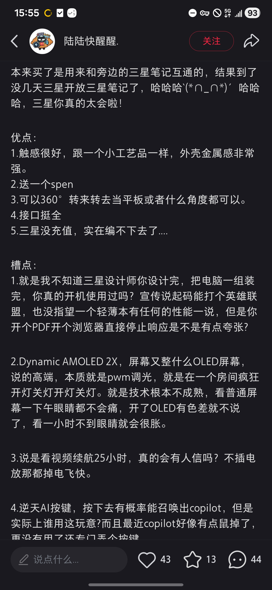

# 香港数码采购+炒股开户攻略

**核心目标**：买 NVIDIA RTX 5090 + 三星旗舰本（带S Pen）+ 办香港银行卡 + 开港股证券账户
**出行方案**：武汉 → 深圳（住）→ 香港（当日往返）→ 深圳 → 武汉
**天数**：2天1晚

***

# 一、出行必备（含开户必备）

## 1.1 证件准备

1. **港澳通行证 + 有效香港个人旅游签注（G签）**
2. 内地身份证原件
3. **过关小白条**（入境香港时海关给的小票，**绝对不能丢**）

### 注意事项

- **办理时间**：建议至少提前10个工作日办理
- **有效期**：个人旅游签注（G签）有效期通常为3个月或1年

## 1.3 其他必备材料

1. 近3个月**住址证明**（水电/燃气/信用卡账单，有姓名+地址）
2. **在职证明（盖章）+ 近6个月工资流水**（银行开户必查）
3. 手机开通香港漫游/流量包（收验证码）
4. 银联/Visa/微信/支付宝
5. 背包（装笔记本+显卡）
6. 现金：**HKD 5,000–10,000**（银行开户首次存款）
7. 

***

# 二、交通全程（武汉 ↔ 深圳 ↔ 香港）

## 2.1 去程：武汉 → 深圳（高铁）

**推荐车次（4月）**

- G389：08:00 武汉 → 12:09 深圳北
  - 时长：4h9m
  - 二等座：¥627.5
- G391：09:00 武汉 → 13:01 深圳北
  - 时长：4h1m
  - 二等座：¥627.5

**深圳北站 → 福田口岸交通**

- **地铁**：深圳地铁4号线（龙华线）
  - 深圳北站上车 → 福田口岸站下车
  - 站点：深圳北站 → 红山 → 上塘 → 龙胜 → 龙华 → 清湖 → 民乐 → 白石龙 → 深圳北 → 福民 → 会展中心 → 市民中心 → 少年宫 → 莲花北 → 福田口岸
  - 票价：¥5
  - 耗时：约25分钟
- **出租车**：
  - 距离：约12公里
  - 费用：约¥40–50
  - 耗时：约20分钟（视交通状况）

**住宿**：住 **福田口岸/罗湖口岸** 附近（步行10分钟内）

- 价格：¥400–700/晚
- 优势：次日一早直接过关

## 2.2 深圳 → 香港（福田口岸最优）

- **深圳地铁**：4号线 → 福田口岸站
- **过关流程**：
  1. 深圳福田口岸出境大厅排队
  2. 刷港澳通行证自助通关
  3. 步行至香港落马洲站
- **港铁**：
  - 线路：落马洲 → 九龙塘 → 旺角
  - 票价：约 **HKD 42**
  - 耗时：≈50分钟

**深圳其他口岸交通（备选）**

- **罗湖口岸**：
  - 深圳地铁1号线（罗宝线）→ 罗湖站
  - 过关 → 香港罗湖站（港铁）
  - 线路：罗湖 → 九龙塘 → 旺角
  - 票价：约HKD 40
- **深圳湾口岸**：
  - 公交B2P → 香港天水围站
  - 港铁：天水围 → 南昌 → 旺角
  - 票价：约HKD 30

**深圳市内交通**

- **地铁**：覆盖主要景点和交通枢纽，推荐使用
- **公交**：覆盖范围广，价格便宜
- **出租车**：起步价¥10（2公里），超出后¥2.6/公里
- **网约车**：滴滴出行、高德打车等App可用

## 2.3 返程：香港 → 深圳 → 武汉

- 旺角 → 落马洲 → 福田口岸 → 深圳
- 深圳北 → 武汉
  - 推荐：G1007（11:56–17:26）、G1025（13:17–18:41）
  - 二等座：¥535–627

***

# 三、行程方案（武汉出发·4月16日周四方案）

## 方案A：周四晚住深圳（原方案）

### Day 1（周四）：武汉 → 深圳

- 08:00 武汉站出发（推荐G389/G391车次）
- 12:30 抵达深圳北 → 地铁到福田口岸
- 13:30 入住酒店（福田口岸附近）
- 14:30 午餐+休息
- 15:00 准备开户材料（整理住址证明、在职证明）
- 16:00 **线上预约银行开户**（提前预约周五上午）
- 18:00 晚餐+早休息

### Day 2（周五）：深圳 → 香港（购物+开户）→ 深圳 → 武汉

- 07:30 起床 → 早餐
- 08:30 福田口岸过关（拿好**小白条**）
- 09:30 抵达 **旺角**
- **10:00–12:00 银行开户（办香港银行卡）**
  - 银行：中银香港/汇丰/渣打（旺角分行，需提前预约）
- **12:30–14:30 数码采购**
  1. 旺角电脑中心：买 **RTX 5090**
  2. 西洋菜街丰泽/三星专卖店：买 **三星旗舰本（带S Pen）**
- **15:00–16:00 开港股证券账户**（券商/银行APP）
- 16:30 旺角 → 落马洲 → 深圳
- 17:00 深圳北 → 武汉（推荐G1007/G1025车次）
- 22:00 抵达武汉

## 方案B：周四晚住赣州，周五到深圳

### Day 1（周四）：武汉 → 赣州

- 14:00 武汉站出发（推荐G2769：14:00–16:42）
- 16:42 抵达赣州西站
- 17:00 入住酒店（赣州西站附近）
- 18:00 晚餐+休息

### Day 2（周五）：赣州 → 深圳 → 香港 → 深圳 → 武汉

- 06:00 起床 → 早餐
- 07:00 赣州西站出发（推荐G2725：07:00–09:45）
- 09:45 抵达深圳北 → 地铁到福田口岸
- 10:30 福田口岸过关（拿好**小白条**）
- 11:30 抵达 **旺角**
- **12:00–14:00 银行开户（办香港银行卡）**
  - 银行：中银香港/汇丰/渣打（旺角分行，需提前预约）
- **14:30–16:30 数码采购**
  1. 旺角电脑中心：买 **RTX 5090**
  2. 西洋菜街丰泽/三星专卖店：买 **三星旗舰本（带S Pen）**
- **17:00–18:00 开港股证券账户**（券商/银行APP）
- 18:30 旺角 → 落马洲 → 深圳
- 19:30 深圳北 → 武汉（推荐G1038：19:30–00:23）
- 00:23 抵达武汉

## 方案C：周四晚火车上过夜，周五到深圳

### Day 1（周四）：武汉 → 深圳（夜间火车）

- 20:00 武汉站出发（推荐Z23：20:00–07:06）
- 夜间在火车上休息（建议购买硬卧或软卧）

### Day 2（周五）：深圳 → 香港 → 深圳 → 武汉

- 07:06 抵达深圳站
- 07:30 早餐
- 08:00 深圳站 → 罗湖口岸（地铁1号线，约10分钟）
- 08:30 罗湖口岸过关（拿好**小白条**）
- 09:30 抵达 **旺角**
- **10:00–12:00 银行开户（办香港银行卡）**
  - 银行：中银香港/汇丰/渣打（旺角分行，需提前预约）
- **12:30–14:30 数码采购**
  1. 旺角电脑中心：买 **RTX 5090**
  2. 西洋菜街丰泽/三星专卖店：买 **三星旗舰本（带S Pen）**
- **15:00–16:00 开港股证券账户**（券商/银行APP）
- 16:30 旺角 → 罗湖 → 深圳
- 17:30 深圳北站 → 武汉（推荐G1007/G1025车次）
- 22:00 抵达武汉

### 时间调整说明

- **方案A优势**：时间充裕，休息充分，适合追求舒适的行程
- **方案B优势**：周四可在武汉处理其他事务，周五紧凑完成所有任务
- **方案C优势**：节省住宿费用，充分利用夜间时间，适合预算有限的旅行者
- **提前预约**：无论选择哪个方案，建议周三前完成银行线上预约
- **返程时间**：可根据实际情况灵活调整返回武汉的车次

***

# 四、香港银行卡开户（炒股必备）

## 4.1 推荐银行（适合内地人）

- **中银香港（BOCHK）**
  - 优点：永久免管理费、支持FPS、内地网点多、易开户
  - 最低存款：HKD 1,000
- **汇丰银行（HSBC）**
  - 优点：全球通用、多币种、网银好用
  - 最低存款：HKD 10,000

## 4.2 开户必备材料（缺一不可）

1. 内地身份证
2. 港澳通行证（有效签注）
3. **入境小白条**
4. 近3个月**住址证明**（水电/信用卡账单）
5. **在职证明（盖章）+ 近6个月工资流水**
6. 首次存款：**HKD 1,000–10,000** 现金

## 4.3 开户流程（旺角分行）

### 汇丰银行预约步骤

1. **访问汇丰银行香港官网**：进入 [汇丰银行香港官网](https://www.hsbc.com.hk/)
2. **选择“个人银行”** → **“开户服务”** → **“预约开户”**
3. **填写个人信息**：包括姓名、身份证号、联系方式等
4. **选择分行**：选择“旺角分行”（地址：旺角弥敦道610号荷李活商业中心）
5. **选择日期和时间**：根据行程安排选择合适的时间段
6. **提交预约**：确认信息后提交，获取预约编号

### 中银香港预约步骤（参考）

- 官网：[中银香港官网](https://www.bochk.com/)
- 路径：个人银行 → 开户服务 → 预约开户
- 同样选择旺角分行，填写个人信息并提交

### 通用开户流程

1. 提前线上预约（银行官网/APP）
2. 到分行取号 → 面谈（说明：**证券投资、买港股**）
3. 提交材料 → 签字 → 存入现金
4. **当场拿卡/密码信**（中银可当场拿卡）
5. 开通网银/手机银行、**FPS转数快**

### 预约注意事项

- **预约所需材料**：提前准备好身份证、港澳通行证、入境小白条、住址证明、在职证明+工资流水
- **首次存款**：汇丰银行最低存款要求为 HKD 10,000（现金），中银香港为 HKD 1,000
- **开户目的**：面谈时说明“个人投资、买港股”，提高开户成功率

***

# 五、港股证券账户开户（炒股用）

## 5.1 选择（2选1）

### 方案A：银行证券户（推荐）

- 中银香港：**中银国际证券**（直接绑港卡）
- 汇丰：**汇丰证券**
- 优势：同银行、转账免费、一键买卖

### 方案B：持牌券商

- 富途牛牛（香港）、老虎证券、耀才证券
- 优势：佣金低、APP好用

## 5.2 开户条件（旅游签注可办）

- 持有**香港银行卡**（本人）
- 身份证 + 通行证 + 住址证明

## 5.3 开户流程（当天可完成）

1. 下载银行/券商APP
2. 注册 → 上传身份证+通行证
3. 风险测评 → 绑定**香港银行卡**
4. 审核（最快**当场通过**）
5. 入金（FPS/EDDA，**免费秒到**）

***

# 六、数码采购（旺角）

## 6.1 NVIDIA RTX 5090 显卡

- **购买地**：旺角电脑中心（2–3楼）
- 品牌：华硕/微星/七彩虹/影驰
- 要点：全新未拆、**港行带票、问清大陆联保**
- 参考价：**HKD 31,000–40,000**

## 6.2 三星带S Pen 最高端笔记本

- **型号**：Galaxy Book3 Ultra / Book4 Pro（带S Pen）
- **购买地**：
  - 旺角西洋菜街：三星专卖店、丰泽、苏宁
  - 尖沙咀海港城
- 要点：**原厂标配S Pen、港行、全国联保**
- 参考价：**HKD 12,000–18,000**

***

# 七、避税与过关（回深圳）

- 显卡+笔记本：**拆封、自用、扔掉包装盒**
- 发票/保修卡：**分开存放**（不与产品放一起）
- 港卡/证券账户：**手机APP即可，无实体材料风险**

***

# 八、费用预算（参考）

- 武汉↔深圳高铁：¥1,255
- 深圳住宿：¥500
- 香港交通：≈¥100
- 港卡开户存款：HKD 1,000（可后续转出）
- 5090显卡：≈¥28,000–35,000
- 三星旗舰本：≈¥11,000–16,000

***

# 九、关键提醒

1. **港卡必须本人赴港开**，不能代办
2. **小白条绝对不能丢**（银行必看）
3. 开户一定要说：**个人投资、买港股**
4. 先办**银行卡**，再开**证券账户**
5. 采购+开户**一天足够**（旺角全部搞定）

